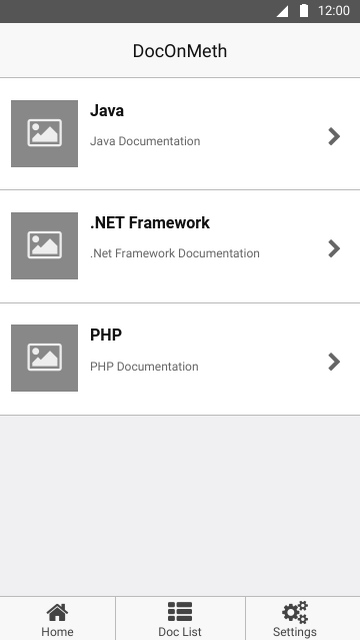
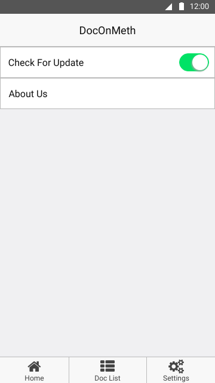
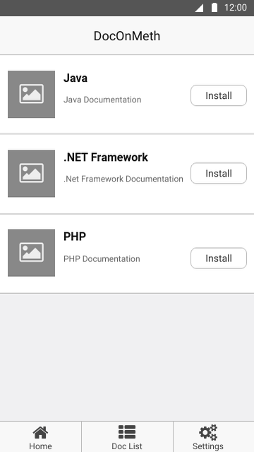
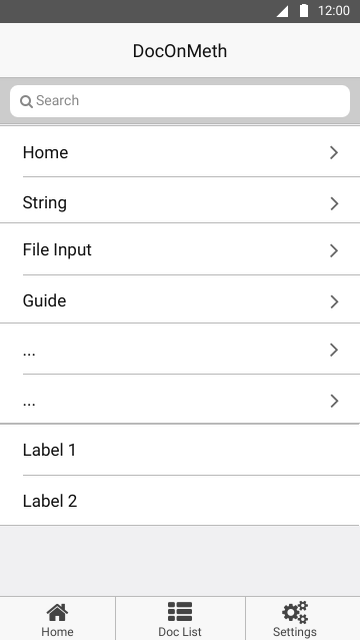
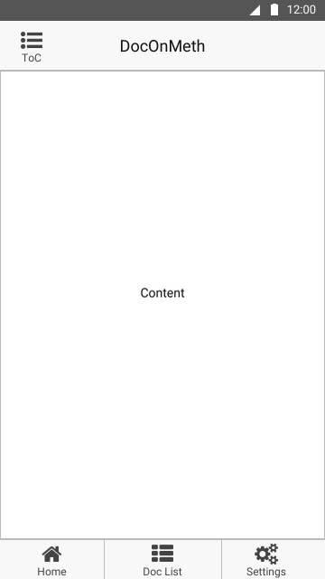

\newpage
\tableofcontents

## Link to DocOnMeth
[Github](https://github.com/juliosueiras/DocOnMeth)

## Purpose Of DocOnMeth

The purpose of DocOnMeth is to provide an android interface to all programming languages/framework/library documentation and as well as offline access to it, since it is a tedious task to go to different sites/places for access different documentation

## User Of DocOnMeth

The user of DocOnMeth will be mostly consists of programmers

\newpage
## Wireframes of DocOnMeth

### Home Page
{width=400 height=400}

\newpage

### Settings Page
{width=400 height=400}

\newpage

### Doc List Page
{width=400 height=400}

\newpage

### Doc Index Page
{width=400 height=400}

\newpage

### Doc View Page
{width=400 height=400}

\newpage
## Choices of Android Feature
The choices of android features will be sqlite for storage access(offline docs), webview for display the docs however if time provided , then html/xml parsing might be use for the purpose of consistent doc presentation(similar to how devdocs does it), Network feature for downloading docs, and lastly Notifications for notice the user for new update(though likely to be push notifications instead of normal notifications)

